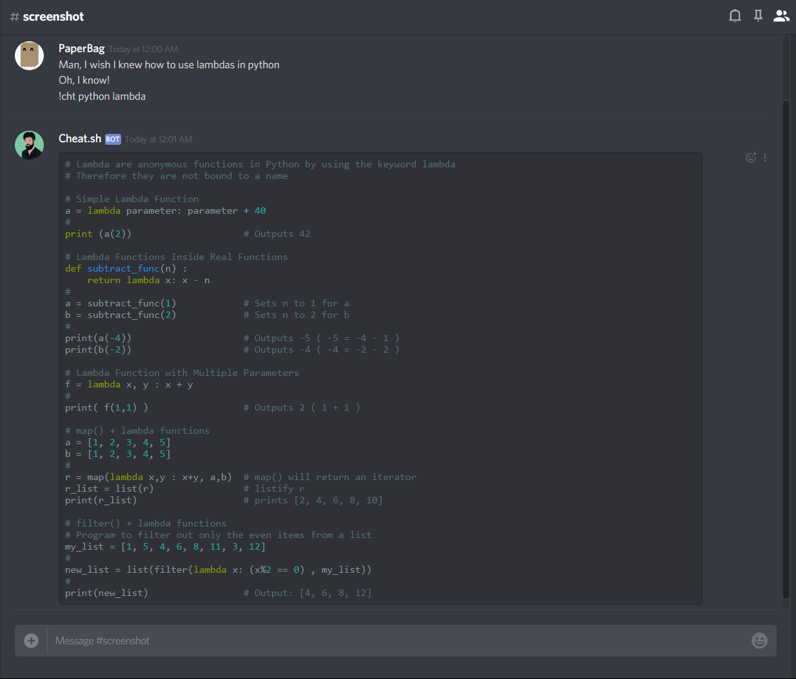

# Cheat.sh for Discord

[](https://app.codacy.com/app/PaperBag42/cheat.sh-discord?utm_source=github.com&utm_medium=referral&utm_content=PaperBag42/cheat.sh-discord&utm_campaign=Badge_Grade_Dashboard)

## The only cheat sheet you need, now on Discord



We all love cheat.sh. Why not share it with friends?
This repository features a Discord bot version of the cht.sh command line client. Here to provide you and your friends with immediate answers. And with the built-in Discord syntax highlighting, it also looks cool while doing it.
The cheat.sh Discord bot can not only save time, but also lmgtfy.com links.

### How to Use
We're currently hosting the bot on Heroku. You're more than welcome to [**invite it to your server.**](https://discordapp.com/api/oauth2/authorize?client_id=467997310790402060&scope=bot&permissions=0 "invite link")
To host it on your own machine, follow these steps:
1. Clone this repository: `git clone https://github.com/PaperBag42/cheat.sh-discord.git`
2. Install the requirements for python 3.6: `python -m pip install -r requirements.txt`
3. Add the bot to your apps [in this page](https://discordapp.com/developers/applications/) and generate an OAuth2 link to add it to your server (no permissions required).
4. Run the script with your token as an argument: `python main.py my-token` OR as an environment variable: `export TOKEN=my-token`.

### Examples
```bash
# use '!cht' to execute queries
!cht go reverse a list
!cht python random list elements
!cht js parse json

# ';' is supported as a replacement to ':' because emojis
!cht python ;learn

# start shell mode on a specific channel
!cht --shell
```
